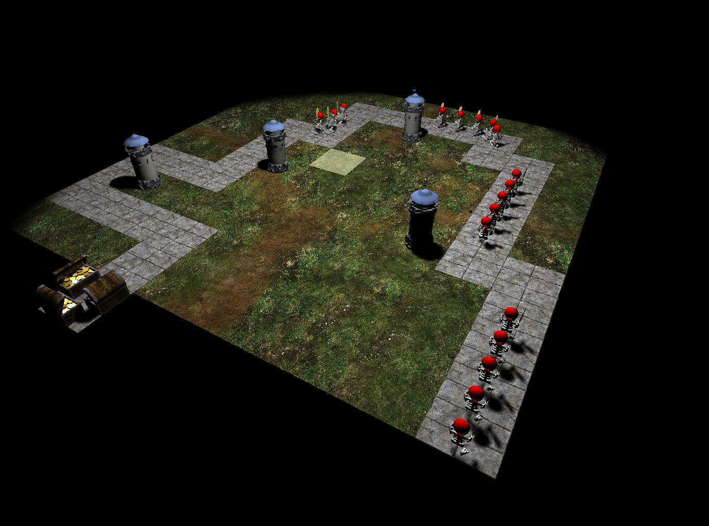

# Tower Defense
----

This project made with OpenGL in C++ is a game that, as the title suggests, belongs in the "Tower Defense" category, a very well-known strategy game subgenre. It was assigned as a prerequisite to pass the Computer Graphics course in the Informatics Department of the Athens University of Economics and Business.

## Rules
The rules are simple. Every few seconds a wave of skeleton pirates spawns on the board's starting point and follows a predetermined path that eventually leads to treasure chests full of gold. The player is a equipped with a number of towers that they can place and reposition at certain squares of the board to fire cannonballs at the pirates and damage them. Defeat all the skeleton pirate waves and you win. Let the pirates steal all of the gold from the trasure chests and you lose. 

  
## Assignment
As the project's file structure was already preset and a lot of the OpenGL configuration is standard, the requirements of the assignment revolved around the modification of the [Renderer.cpp](/Lab6/Renderer.cpp) and [main.cpp](/Lab6/main.cpp) files and their corresponding headers. More specifically, the main tasks were to:

- Load the assets into the scene.
- Transform each static asset in order for it to be placed in the correct coordinates of the scene (board, tiles, trasure chests, etc.).
- Implement constant transformation of our "dynamic" assets to emulate the desired animations and movements (pirate body parts, cannonballs fired from the towers).
- Implement collision detection.
- Implement the logic of the game.

## Keys
- Press T to place a tower if one is available in the tower pool.
- Press R to remove a tower and put it back into the tower pool.

  
#### For further information, the full description of the project can be found **[here](CG_Project_2019.pdf)**.
